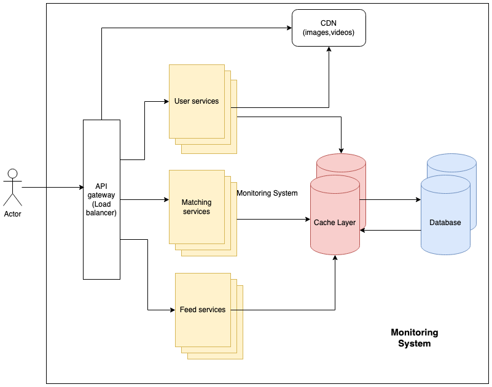
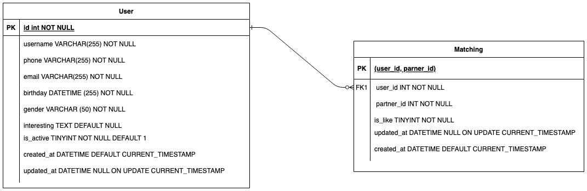

# AndPadDating

### Requirements

#### Functional requirements:
+ CRUD user profile
+ Authen/Autho
+ User feed: list of people that users can like or dislike
+ user matching:
    + like people
    + dislike people
    + list people liked
    + list people like an user
    + list people matched with each other
    + private chat, video call (extra)

#### Non-functional requirements:
+ Security users' information
+ Reliable, scalable
+ Monitering performance


### System design

#### High Level



#### Database Schema



### Teck stack

#### Programming language
##### Golang
##### Golang tech stack
+ Independency Injection framework: [wire](https://github.com/google/wire)
+ Dtabase ORM: [gorm](https://github.com/go-gorm/gorm)
+ Unit test: [mockery](https://github.com/vektra/mockery)
+ Code format: [golangci-lint](https://github.com/golangci/golangci-lint)

#### Database
+ Mysql
+ blob database: [MinIO](https://min.io/)
+ cache: Redis

### Demo (updating...)
+ Build:
```bash
make build
```
+ Test average covering:
```bash
make test-unit
```
